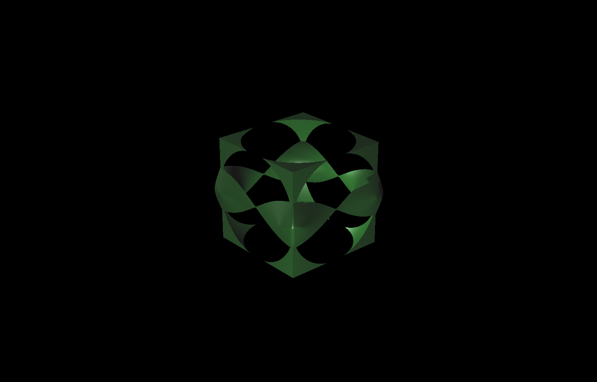
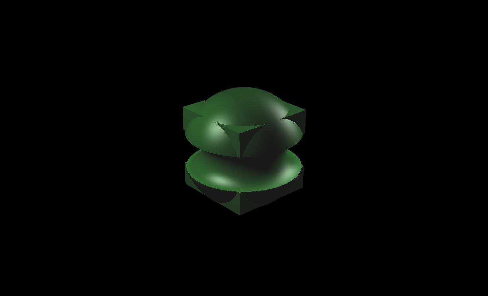

# CMPM163_HW3
Alfredo Cuevas - acuevas5

PartA- Part A was extra credit and I did not complete it.

PartB- Shadertoy-Style Scene - <b>HW3PartB.html</b> 
  For this part of the assignment I used plane geometry provided by THREE.js and created a simple vertex shader that just placed that plane on the screen. All the important code is found inside of the fragment shader. I used this shadertoy example as my base for creating the fragment shader, https://www.shadertoy.com/view/lt33z7. What the fragment shader is doing is shooting out rays to each pixel on screen. It marches through the scene and if it intersects an object then that pixel is given a different color. The phong lighting calculates normals and then determines how much ambient, specular, and diffuse light will affect the color of the object. My objects are created using Signed Distance Functions. I use the union, subtraction, and intersection operators to create unique shapes. I then use the mix function to change between them using a time value. I had some trouble getting any interesting shapes to come about. This is probably due to a lack of artistic skill on my part though.
  
 PartC-<b>HW3PartC.pdf</b>
  For this part of the assignment I looked into createing caustic effects. My main source for this was from <i>GPU Gems</i> http://developer.download.nvidia.com/books/HTML/gpugems/gpugems_ch02.html. 
 

